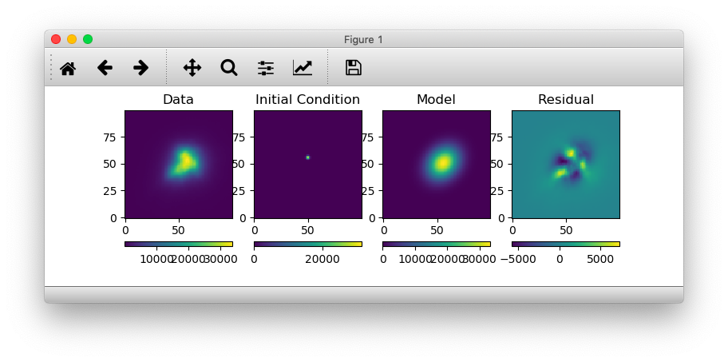

# PSF Fitting Practice

Rudimentary code to fit a Guassian model to the Point Spread Function (PSF) of a star.

## Notes
* [PSF_00.py](PSF_00.py) file includes an **absolute file path**.
* Fix this path accordingly to run the script.

